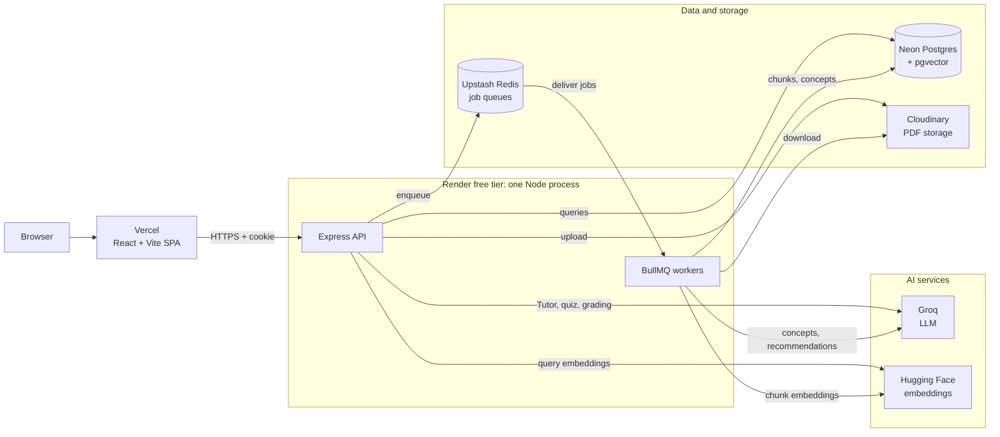

# 🎓 LearnMate AI (AI Study Companion)

LearnMate AI turns your own study material into a personal tutor that knows what you're missing. Organize work into **Spaces** and **Projects**, upload **Materials** (PDFs), and ask a **Tutor** questions answered only from what you uploaded, with page citations and an explicit "not enough evidence" reply when your material doesn't cover it. A **Quiz** targets what you're weakest at, grades free-text answers with feedback, and updates your **Mastery** per concept. Keep missing a concept and a background job produces a **Recommendation** grounded in your own material, while **Growth** shows up as trends on your dashboard.

```
Space → Project → Material → Tutor → Quiz → Mastery → Growth → Recommendation
```

## 🔗 Live links

| | URL |
|---|---|
| Frontend (Vercel) | https://learn-mate-ai-mauve.vercel.app |
| Backend API (Render) | https://learnmate-ai-necf.onrender.com (health check: `/health`) |

> **Heads up:** the backend is on Render's free tier and sleeps after inactivity, so the first request after a quiet period can take **30–60 seconds**.

## 🧭 Architecture at a glance

- **Material processing** (background job): per-page text extraction, chunking (~550 words, one page per chunk so citations stay accurate), embeddings with `BAAI/bge-small-en-v1.5` into pgvector, and up to 15 extracted concepts. Scanned pages use OCR only if the optional `canvas` module is installed.
- **Tutor**: similarity search over that project's chunks only. The model returns `sufficientEvidence` plus citations as schema-validated JSON, so "not enough evidence" is a structural check.
- **Quiz**: the next question targets the concept with the highest score across mastery gap, under-practice, days since practiced, and recent mistakes. MCQs are graded by comparison, open answers by the LLM against your material.
- **Mastery**: an append-only history (new evidence weighted 60/40 over the prior score), classified as improving, stable, needs-attention, or new.
- **Recommendations**: 2+ scores below 70 in a concept's last 5 attempts triggers a background job (at most one per user and project per day).

## 🗺️ System diagram



## 🧰 Tech stack

| Technology | Why it's here |
|---|---|
| React, Vite, TypeScript, Tailwind, Recharts | Frontend, styling, analytics charts |
| Node.js, Express, TypeScript | REST API |
| Prisma + PostgreSQL (Neon) + pgvector | Relational data and vector search in one database |
| BullMQ + Redis (Upstash), Bull Board | Background jobs with retries; admin job dashboard |
| Groq | LLM for Tutor, quiz, grading, concepts, recommendations |
| Hugging Face Inference API | Hosted embeddings (384 dimensions); no local model runs |
| Cloudinary | PDF storage |
| pdfjs-dist, tesseract.js | Per-page text extraction with OCR fallback |
| Zod | Validates config and every LLM response |
| JWT (HTTP-only cookie), bcryptjs | Authentication |
| Jest, Supertest | Tests against real infrastructure |
| Vercel, Render, Neon, Upstash | Hosting, all free tiers |

## 🚀 Run it locally

About 15 minutes if you already have the accounts below; every service has a free tier.

### 📋 1. Prerequisites

- **Node.js 20+** and **npm 10+**
- **PostgreSQL with `pgvector`:** easiest is a free [Neon](https://neon.tech) database (a stock local Postgres usually lacks pgvector).
- **Redis:** a free [Upstash](https://upstash.com) database, or a local `redis-server`.
- **API keys:** [Groq](https://console.groq.com), a [Hugging Face](https://huggingface.co/settings/tokens) token, and a [Cloudinary](https://cloudinary.com) account.

### 📥 2. Clone and install

```bash
git clone https://github.com/Umeshchandra2024/LearnMate-AI.git
cd LearnMate-AI
npm install
```

A build failure for the optional `canvas` package is fine: everything works except OCR on scanned PDF pages.

### 🔧 3. Configure environment

Create `.env` in the **repository root**:

```bash
cp .env.example .env          # Windows PowerShell: Copy-Item .env.example .env
```

| Variable | Notes |
|---|---|
| `DATABASE_URL` | Postgres connection string (Neon: include `?sslmode=require`) |
| `REDIS_URL` | `redis://localhost:6379` locally. **Hosted Redis like Upstash needs `rediss://` (TLS)**, otherwise the app hangs on queue calls |
| `JWT_SECRET` | Random string, 16+ characters |
| `GROQ_API_KEY`, `GROQ_MODEL`, `GROQ_FAST_MODEL` | Groq key, a model for Tutor/concepts, and a smaller one for quiz/grading/recommendations |
| `EMBEDDINGS_PROVIDER`, `EMBEDDINGS_MODEL`, `EMBEDDINGS_DIMENSIONS` | Leave as `huggingface`, `BAAI/bge-small-en-v1.5`, `384` (must match the `vector(384)` column) |
| `HUGGINGFACEHUB_API_TOKEN` | Your Hugging Face token |
| `CLOUDINARY_CLOUD_NAME`, `CLOUDINARY_API_KEY`, `CLOUDINARY_API_SECRET` | From your Cloudinary dashboard |
| `PORT`, `NODE_ENV`, `CLIENT_ORIGIN` | `4000`, `development`, `http://localhost:5173` locally |
| `JWT_EXPIRES_IN`, `COOKIE_NAME` | Optional; default `7d` and `asc_token` |

`OPENAI_API_KEY`, `OPENAI_BASE_URL` and `OPENAI_MODEL` are also read by the code (not in `.env.example`) and enable an optional fallback provider.

**Groq models:** availability differs per account. This project used `openai/gpt-oss-120b` and `openai/gpt-oss-20b`; the `GROQ_MODEL` default in `.env.example` (`llama-3.3-70b-versatile`) wasn't available there. List what your key can use with:

```bash
curl https://api.groq.com/openai/v1/models -H "Authorization: Bearer $GROQ_API_KEY"
```

The frontend needs no `.env` locally: Vite proxies `/api` to `http://localhost:4000`.

### 🗄️ 4. Set up the database and build `shared`

```bash
npm run db:generate    # generate the Prisma client
npm run db:migrate     # apply migrations (the first also runs CREATE EXTENSION vector)
npm run build:shared   # server and worker import the compiled shared/dist
```

### ▶️ 5. Start all three processes

In **three terminals** at the repo root:

```bash
npm run dev:server     # API on http://localhost:4000
npm run dev:worker     # BullMQ worker (processes uploaded PDFs)
npm run dev:client     # frontend on http://localhost:5173
```

> **Don't forget the worker.** Without it, uploads succeed but materials sit in `QUEUED` forever. Its terminal should print `Worker process started, listening for jobs...`.

### 🎮 6. Try it

1. Open http://localhost:5173 and sign up, then create a Space and a Project.
2. Upload a PDF (`scripts/fixtures/sample-material.pdf` works) and wait for `READY`.
3. Ask the **Tutor** something the PDF covers, then something it doesn't.
4. Take a **Quiz**, then check mastery, **Analytics** and the **Home** dashboard.

There's no admin signup, by design. To see the **Admin** area, set `isAdmin` to `true` on your user (for example with `npx prisma studio --schema=./prisma/schema.prisma`), then log out and back in.

### 🛠️ Troubleshooting

| Symptom | Cause |
|---|---|
| Material stays `QUEUED`, or queue calls hang | Worker not running, or hosted Redis needs `rediss://` |
| `Cannot find module ... shared/dist` | Run `npm run build:shared` |
| `type "vector" does not exist` on migrate | Your Postgres lacks pgvector; use Neon |
| Tutor/Quiz return 500 with model-not-found | `GROQ_MODEL` / `GROQ_FAST_MODEL` isn't available to your key |

## ☁️ Deployment

Frontend on **Vercel**, backend as one **Render** Web Service, with Neon and Upstash.

- **Frontend:** a standard Vite build of `client`. Set `VITE_API_URL` to the Render URL; without it the client makes relative `/api` calls, which only work locally through the dev proxy.
- **Backend (combined process):** Render's free tier has no free background worker, so `server/src/combined.ts` starts the API and then `require()`s the compiled worker (`worker/dist/index.js`) into the same process.
- **Render settings:** leave **Root Directory** at the repo root. Build Command `npm run render-build:combined`, Start Command `node server/dist/combined.js`.
- **Render environment:** the variables above, plus `NODE_ENV=production` (makes the auth cookie `SameSite=None; Secure`, needed for Vercel-to-Render requests) and `CLIENT_ORIGIN=<your Vercel URL>`.
- **Separate services:** on a paid plan you can run two, using `render-build:api` / `node server/dist/index.js` and `render-build:worker` / `node worker/dist/index.js`.

## 🧪 Testing

```bash
npm test               # server + worker suites
npm run test:server    # Jest + Supertest
npm run test:worker    # Jest
npm run eval:tutor     # Tutor grounding eval
npm run eval:quiz      # quiz grading eval
```

These are **integration tests against real infrastructure** (your `.env` database, Redis and LLM/embedding APIs), so they use API quota and take a minute or two.

| Test | What it proves |
|---|---|
| `crossUserIsolation` | One user can't read or confirm another's data; cross-user access returns 404, not 403 |
| `adminAccess` | `requireAdmin` rejects non-admins (403) and unauthenticated requests (401) on every admin route |
| `logout` | Logout ends the session, with cookie attributes matching login |
| `masteryMath` | The mastery blend and trend classification |
| `adaptiveSelection` | Unassessed and mistake-prone concepts outrank strong ones |
| `tutorGroundedness` | Answerable questions get citations; unanswerable ones get none |
| `materialProcessingIdempotency` (worker) | A retried job leaves no duplicate rows |

The eval scripts save results to `scripts/eval-results/*.json` (git-ignored; the Admin → Evals tab renders them).

**Seeded data required.** `tutorGroundedness` and both eval scripts expect a project named exactly `Cell Biology Unit` with `scripts/fixtures/sample-material.pdf` uploaded. Create it, then set `TEST_USER_EMAIL` at the top of those three files to your email.

**Known caveats:**

- In the last full run all 34 tests passed (33 server, 1 worker). The server config sets `testTimeout: 60000` for the remote database and live LLM, and Jest doesn't exit by itself after the server run, so use `--forceExit`.
- `npm test` chains the two workspaces with `&&`, so a failing server suite skips the worker suite; run `npm run test:worker` directly instead.
- There are **no frontend component tests**; the UI was verified in a real browser.

## 📁 Project structure

```
LearnMate-AI/
├── client/                 React + Vite frontend
│   └── src/
│       ├── pages/          Screens: Spaces, Project, Tutor, Quiz, Analytics, Home, Admin
│       ├── components/     Layout, route guards, UI pieces
│       └── api/            Typed fetch client (base URL from VITE_API_URL)
│
├── server/                 Express API
│   └── src/
│       ├── routes/         URL routes
│       ├── controllers/    Request handling and ownership checks
│       ├── middleware/     requireAuth, requireAdmin, error handling
│       ├── index.ts        Starts the API only
│       └── combined.ts     Starts API + worker in one process (free Render)
│
├── worker/                 BullMQ background jobs
│   └── src/
│       ├── processors/     material-processing, mastery-update, recommendations
│       └── lib/            PDF extraction, OCR, chunking, concept extraction
│
├── shared/                 Code used by both server and worker (built to dist/)
│   └── src/                callAI, embeddings, tutor, quiz, mastery, queues, env
│
├── prisma/                 schema.prisma and migrations
└── scripts/                Eval scripts, sample PDFs, saved eval results
```
