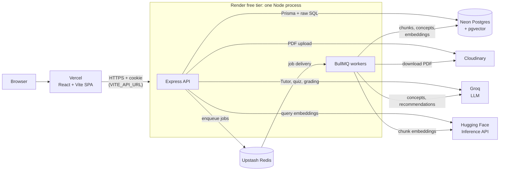

# LearnMate AI (AI Study Companion)

LearnMate AI turns your own study material into a personal tutor that knows what you're missing. You organize work into **Spaces** (a course or subject) and **Projects** (a unit or goal) and upload **Materials** (PDFs). The app extracts the key concepts and lets you ask a **Tutor** questions answered only from what you uploaded, with page citations, and an explicit "not enough evidence" response when your material doesn't cover the question. A **Quiz** picks what to ask next based on what you're weakest at, grades free-text answers with feedback on what you got right and what you missed, and updates your **Mastery** per concept over time. When you keep missing the same concept, a background job produces a **Recommendation** grounded in your own material, and **Growth** shows up as trends on your dashboard.

```
Space → Project → Material → Tutor → Quiz → Mastery → Growth → Recommendation
```

## Live links

| | URL |
|---|---|
| Frontend (Vercel) | https://learn-mate-ai-mauve.vercel.app |
| Backend API (Render) | https://learnmate-ai-necf.onrender.com (health check: `/health`) |

> **Heads up:** the backend runs on Render's free tier, which spins the service down after inactivity. The first request after a quiet period can take **30–60 seconds** (signup/login will just look slow). After that it's fast.

## Architecture at a glance



- **Material processing** (background job): text is extracted per page, chunked (~550 words, one page per chunk so citations stay accurate), embedded with `BAAI/bge-small-en-v1.5` into pgvector, and up to 15 key concepts are extracted. Scanned pages fall back to OCR only if the optional `canvas` module is installed.
- **Tutor**: cosine-similarity search over that project's chunks only. The model must return `sufficientEvidence` plus citations as schema-validated JSON, so "not enough evidence" is a structural check, not a prompt hope.
- **Quiz**: the next question targets the concept with the highest score across mastery gap, under-practice, days since practiced, and recent mistakes (with a ~1-in-5 review of a strong concept). MCQs are graded by comparison; open answers by the LLM against your material.
- **Mastery**: an append-only history (new evidence weighted 60/40 over the prior score), so trends can be classified: improving, stable, needs-attention, or new.
- **Recommendations**: 2+ scores below 70 in a concept's last 5 attempts triggers a background job (at most one per user and project per day).

## Tech stack

| Technology | Why it's here |
|---|---|
| React 18, Vite, TypeScript, Tailwind, Recharts | The SPA frontend, styling, and analytics charts |
| Node.js, Express, TypeScript | The REST API |
| Prisma + PostgreSQL (Neon), pgvector | Relational data plus vector search in one database |
| BullMQ + Redis (Upstash), Bull Board | Background jobs with retries and backoff; admin job dashboard at `/api/admin/queues` |
| Groq | LLM for the Tutor, quiz generation/grading, concept extraction, recommendations |
| Hugging Face Inference API | Hosted embeddings (384 dimensions); no local model runs |
| OpenAI-compatible provider (optional) | Last-resort fallback, only active if `OPENAI_API_KEY` is set |
| Cloudinary | PDF storage |
| pdfjs-dist, tesseract.js (optional `canvas`) | Per-page text extraction with an OCR fallback |
| Zod | Validates environment config and every schema-constrained LLM response |
| JWT (HTTP-only cookie), bcryptjs | Authentication |
| Jest, Supertest | Backend and worker tests, run against real infrastructure |
| Vercel, Render, Neon, Upstash | Hosting, all on free tiers |

## Run it locally

Budget about 15 minutes if you already have the accounts below. Every service has a free tier.

### 1. Prerequisites

- **Node.js 20+** and **npm 10+**
- **PostgreSQL with `pgvector`.** Easiest is a free [Neon](https://neon.tech) database. A stock local Postgres usually lacks pgvector; if you run one locally, use an image that bundles it (for example `pgvector/pgvector:pg16`).
- **Redis:** a free [Upstash](https://upstash.com) database, or a local `redis-server`.
- **API keys:** [Groq](https://console.groq.com), a [Hugging Face](https://huggingface.co/settings/tokens) token, and a [Cloudinary](https://cloudinary.com) account.

### 2. Clone and install

```bash
git clone https://github.com/Umeshchandra2024/LearnMate-AI.git
cd LearnMate-AI
npm install
```

`npm install` may print a build failure for the optional `canvas` package (it needs native build tools, notably on Windows). That's fine: without it everything works except OCR on scanned PDF pages.

### 3. Configure environment

Create `.env` in the **repository root**; the server, worker, tests, and Prisma all read it from there.

```bash
cp .env.example .env          # Windows PowerShell: Copy-Item .env.example .env
```

| Variable | Notes |
|---|---|
| `DATABASE_URL` | Postgres connection string (for Neon, the one from the dashboard, with `?sslmode=require`) |
| `REDIS_URL` | `redis://localhost:6379` locally. **Hosted providers like Upstash need `rediss://` (TLS)**; with plain `redis://` the app hangs on every queue call instead of erroring |
| `JWT_SECRET` | Any random string of 16+ characters |
| `JWT_EXPIRES_IN`, `COOKIE_NAME` | Optional; default `7d` and `asc_token` |
| `GROQ_API_KEY` | Your Groq key |
| `GROQ_MODEL` | Model for the Tutor and concept extraction |
| `GROQ_FAST_MODEL` | Smaller/faster model for quiz generation, grading, recommendations |
| `EMBEDDINGS_PROVIDER`, `EMBEDDINGS_MODEL`, `EMBEDDINGS_DIMENSIONS` | Leave as `huggingface`, `BAAI/bge-small-en-v1.5`, `384`. The dimension must match the database's `vector(384)` column |
| `HUGGINGFACEHUB_API_TOKEN` | Your Hugging Face token |
| `CLOUDINARY_CLOUD_NAME`, `CLOUDINARY_API_KEY`, `CLOUDINARY_API_SECRET` | From your Cloudinary dashboard |
| `PORT` | API port, default `4000` |
| `NODE_ENV` | `development` locally; must be `production` in production (see Deployment) |
| `CLIENT_ORIGIN` | Frontend origin allowed by CORS, `http://localhost:5173` locally |

Also read by the code but not in `.env.example`: `OPENAI_API_KEY`, `OPENAI_BASE_URL`, `OPENAI_MODEL`, which enable the optional fallback provider.

**Groq models:** availability differs per account. This project was developed with `GROQ_MODEL="openai/gpt-oss-120b"` and `GROQ_FAST_MODEL="openai/gpt-oss-20b"`. The `GROQ_MODEL` default in `.env.example` (`llama-3.3-70b-versatile`) was not available on that account, so list what your key can use and set both values accordingly:

```bash
curl https://api.groq.com/openai/v1/models -H "Authorization: Bearer $GROQ_API_KEY"
```

The frontend needs no `.env` locally: Vite proxies `/api` to `http://localhost:4000`.

### 4. Set up the database and build `shared`

```bash
npm run db:generate    # generate the Prisma client
npm run db:migrate     # apply migrations; the first one also runs CREATE EXTENSION vector
npm run build:shared   # server and worker import the compiled shared/dist
```

### 5. Start all three processes

Open **three terminals** at the repo root:

```bash
npm run dev:server     # API on http://localhost:4000
npm run dev:worker     # BullMQ worker (processes uploaded PDFs)
npm run dev:client     # frontend on http://localhost:5173
```

> **Don't forget the worker.** With only the server and client running, uploads succeed but materials sit in `QUEUED` forever, because nothing consumes the job queue. The worker terminal should print `Worker process started, listening for jobs...`.

### 6. Try it

1. Open http://localhost:5173 and sign up.
2. Create a Space, then a Project inside it.
3. Upload a PDF (`scripts/fixtures/sample-material.pdf` works). Status goes `QUEUED → PROCESSING → READY`.
4. Open the **Tutor** and ask something the PDF covers, then something it doesn't.
5. Start a **Quiz**, then check the mastery section, **Analytics**, and the **Home** dashboard.

There's no signup path for admins, by design. To see the **Admin** area, set `isAdmin` to `true` on your user (for example with `npx prisma studio --schema=./prisma/schema.prisma`), then log out and back in.

### Troubleshooting

| Symptom | Cause |
|---|---|
| Material stays `QUEUED`, or a queue call hangs with no error | The worker isn't running, or hosted Redis needs `rediss://` |
| `Cannot find module ... shared/dist` | Run `npm run build:shared` |
| Migration fails with `type "vector" does not exist` | Your Postgres lacks pgvector; use Neon |
| Quiz/Tutor return 500 with model-not-found in the server log | `GROQ_MODEL` / `GROQ_FAST_MODEL` isn't available to your key |
| `Invalid environment configuration` on boot | A required var is missing or `JWT_SECRET` is under 16 characters |

## Deployment

The reference deployment is the frontend on **Vercel** and one **Render** Web Service backed by Neon and Upstash.

**Frontend (Vercel):** a standard Vite build of `client`. Set `VITE_API_URL` to the Render service URL; without it the client makes relative `/api` requests, which only work locally through the dev proxy.

**Backend (Render): combined API + worker in one process.** Render's free tier has no free background worker, so `server/src/combined.ts` starts the Express API and then `require()`s the worker's compiled entry (`worker/dist/index.js`) into the same Node process. The worker code is untouched, and on a redeploy the whole process shuts down together.

Leave **Root Directory** at the repo root (pointing it at `/server` breaks the workspace build):

| Setting | Value |
|---|---|
| Build Command | `npm run render-build:combined` |
| Start Command | `node server/dist/combined.js` |

Environment on Render: everything in the table above, plus `NODE_ENV=production` (makes the auth cookie `SameSite=None; Secure`, which browsers require for cross-origin requests from Vercel) and `CLIENT_ORIGIN=<your Vercel URL>`.

**Separate processes.** The two halves don't depend on being combined. On a paid Render plan you can deploy two services instead: API with `npm run render-build:api` / `node server/dist/index.js`, and worker with `npm run render-build:worker` / `node worker/dist/index.js`.

## Testing

```bash
npm test               # server + worker suites, in sequence
npm run test:server    # Jest + Supertest
npm run test:worker    # Jest
npm run eval:tutor     # Tutor grounding eval
npm run eval:quiz      # quiz grading eval
```

These are **integration tests against real infrastructure** (your `.env` database, Redis, and LLM/embedding APIs), so they use API quota and take a minute or two.

| Test | What it proves |
|---|---|
| `crossUserIsolation` | User A can't read, modify, or confirm the existence of user B's data; cross-user access returns 404, not 403 |
| `adminAccess` | `requireAdmin` rejects non-admins (403) on every admin route including Bull Board, and unauthenticated requests (401) |
| `logout` | Logout actually ends the session, with cookie attributes that match login |
| `masteryMath` | The mastery blend and trend classification at every data volume |
| `adaptiveSelection` | Unassessed and mistake-prone concepts outrank strong ones |
| `tutorGroundedness` | Answerable questions get `sufficientEvidence` and citations; unanswerable ones get neither |
| `materialProcessingIdempotency` (worker) | A retried material-processing job leaves no duplicate Chunk/Concept rows |

The eval scripts (`scripts/eval-tutor.ts`, `scripts/eval-quiz.ts`) run hand-written cases against real retrieval and LLM calls and save results to `scripts/eval-results/*.json` (git-ignored; the Admin → Evals tab renders them).

**Seeded data required.** `tutorGroundedness` and both eval scripts expect a project named exactly `Cell Biology Unit` with `scripts/fixtures/sample-material.pdf` uploaded and `READY`. Sign up, create it, then set `TEST_USER_EMAIL` at the top of those three files to your email. Concept names are LLM-extracted, so `eval-quiz` (which looks up Photosynthesis, Cellular Respiration, and Chlorophyll) may need its names adjusted.

**Known caveats:**

- In the last full run all 34 tests passed (33 server, 1 worker). The server config sets `testTimeout: 60000` because the suites use a remote database and a live LLM, and Jest doesn't exit by itself after the server run (open connections), so that run used `--forceExit`.
- `npm test` chains the two workspaces with `&&`, so a failing server suite stops the worker suite; use `npm run test:worker` directly to run it regardless.
- There are **no frontend component tests**. The UI was verified by driving it in a real browser, not by an automated suite.

## Project structure

```
.
├── client/     React + Vite frontend (pages, typed API client, UI components)
├── server/     Express API (routes, controllers with ownership checks, middleware)
│   └── src/    index.ts = API only; combined.ts = API + worker (free-tier Render)
├── worker/     BullMQ processors: material-processing, mastery-update,
│               recommendation-generation; PDF extraction, OCR, chunking, concepts
├── shared/     Used by server and worker, built to shared/dist: callAI (the single
│               LLM entry point, logs every call), embeddings, tutor, quiz + adaptive
│               selection, mastery, recommendations, queues, env validation, Prisma client
├── prisma/     schema.prisma and migrations (includes CREATE EXTENSION vector)
└── scripts/    eval-tutor.ts, eval-quiz.ts, fixtures/ (sample PDFs), eval-results/
```
